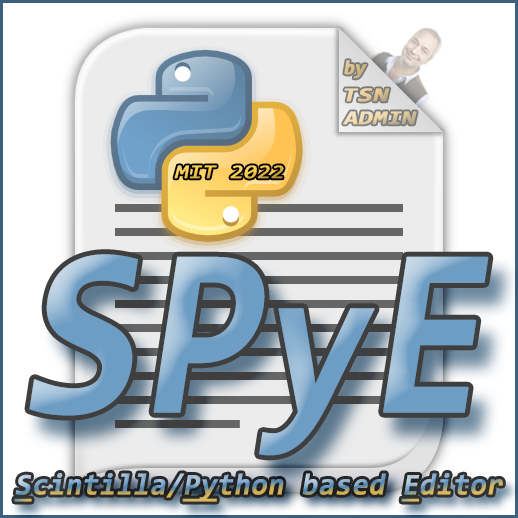

# SPyE - [S]cintilla/[Py]thon based [E]ditor
Yet another source code editor. Download and view the [ScreenCast](https://github.com/TSN-ADMIN/SPyE/blob/master/SPyE-ScreenCast.7z) if you dare ;-)

Developed in [Python](https://www.python.org) and:
- [Scintilla](https://www.scintilla.org) source code editing component by [Neil Hodgson et al](https://en.wikipedia.org/wiki/Scintilla_(software))
- [wxPython (Phoenix)](https://wxpython.org) GUI framework by [Robin Dunn et al](https://en.wikipedia.org/wiki/WxPython)

#### *More - including source code - coming soon ...*

[comment]: 

[comment]: &nbsp;&nbsp;&nbsp;&nbsp;&nbsp;&nbsp;&nbsp;&nbsp;&nbsp;&nbsp;&nbsp;&nbsp;&nbsp;&nbsp;&nbsp;&nbsp;&nbsp;&nbsp;&nbsp;

 

